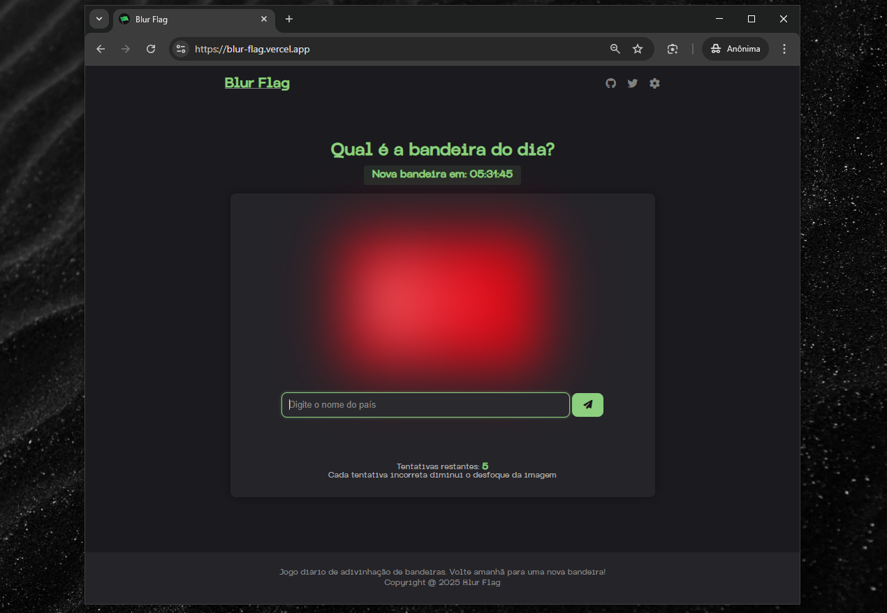
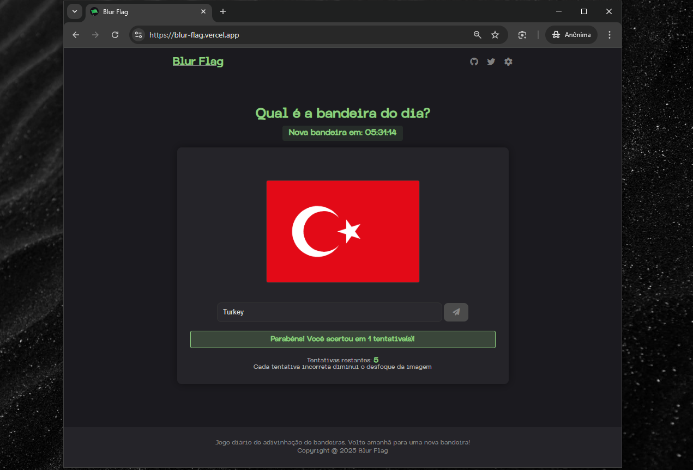

<br>
<br>
<br>
<div align="center">
  
</div>
<br>
<br>
<hr>


Blur Flag é um jogo diário de adivinhação de bandeiras. Tente identificar a bandeira do dia conforme o desfoque diminui a cada tentativa incorreta!

## Demonstração

O jogo está disponível em [Blur FLag](https://blur-flag.vercel.app)

## Descrição

Blur Flag desafia os jogadores a identificarem países pela sua bandeira, inicialmente apresentada com um forte desfoque. A cada tentativa incorreta, o desfoque diminui gradualmente revelando mais detalhes da imagem.

### Características Principais

- Uma nova bandeira de país todos os dias
- Cronômetro para mostrar quando a próxima bandeira estará disponível
- Sistema de desfoque progressivo que diminui a cada tentativa incorreta
- Dicas baseadas na letra inicial do país
- Design responsivo para dispositivos desktop e móveis

## Como Jogar

1. Acesse [Blur Flag](https://blur-flag.vercel.app)
2. Observe a bandeira desfocada e tente adivinhar qual país ela representa
3. Digite sua resposta no campo indicado
4. Se errar, o desfoque diminuirá para sua próxima tentativa
5. Você tem 5 tentativas para acertar

## Screenshots

<div align="center">
  
  
</div>

## Tecnologias Utilizadas

- **Frontend**: HTML5, CSS3, JavaScript
- **Backend**: Python, Flask
- **Banco de Dados**: SQLite
- **API**: RESTCountries para informações sobre países e bandeiras
- **Deployment**: Vercel

## Estrutura do Projeto

```
blur-flag/
├── app.py                  # Aplicação principal Flask
├── utils/                  # Utilitários
│   └── atualizar_banco.py  # Script para atualizar o banco de dados de bandeiras
├── static/
│   ├── css/                # Estilos
│   ├── js/                 # JavaScript
│   ├── images/             # Imagens e ícones
│   └── fonts/              # Fontes personalizadas
├── templates/              # Templates HTML
└── bandeiras.db            # Banco de dados SQLite de bandeiras
```

## Instalação e Execução

1. Clone o repositório
   ```bash
   git clone https://github.com/RafaelTwee/blur-flag.git
   cd blur-flag
   ```

2. Instale as dependências
   ```bash
   pip install -r requirements.txt
   ```

3. Atualize o banco de dados de bandeiras
   ```bash
   python utils/atualizar_banco.py
   ```

4. Execute a aplicação
   ```bash
   python app.py
   ```

5. Acesse `http://localhost:5000` no navegador

## Próximas Atualizações

- [ ] Sistema de estatísticas para jogadores
- [ ] Compartilhamento de resultados nas redes sociais
- [ ] Modo de treino com bandeiras aleatórias
- [ ] Mais temas visuais
- [ ] Opções de acessibilidade

## Contribuições

Contribuições são bem-vindas! Sinta-se à vontade para abrir issues ou enviar pull requests.

## Licença

Este projeto ainda não possui uma licença.

---

<div align="center">
  <p>
    Desenvolvido com ❤️ por <a href="https://github.com/RafaelTwee">Rafael Twee</a>
  </p>
  <p>
    <a href="https://twitter.com/tweevlr">Twitter</a> •
    <a href="https://github.com/RafaelTwee/blur-flag">GitHub</a>
  </p>
</div>
